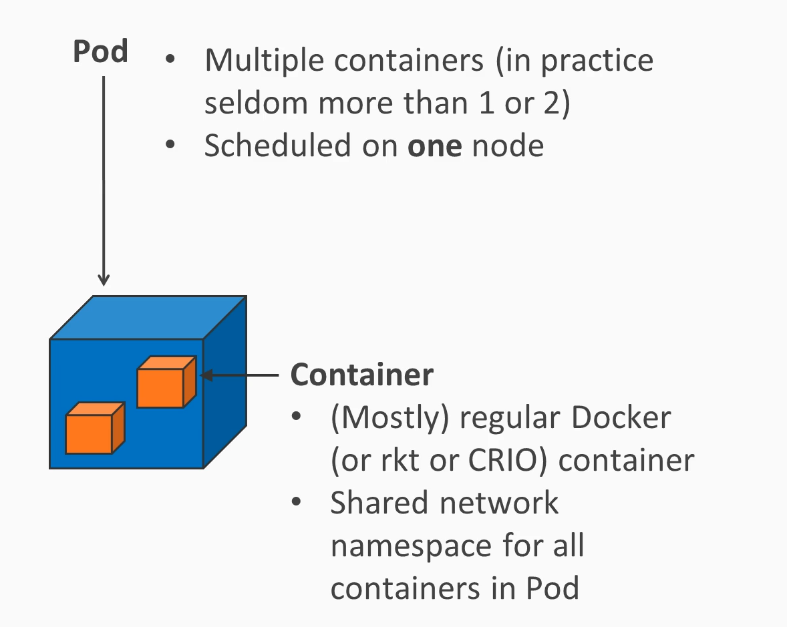
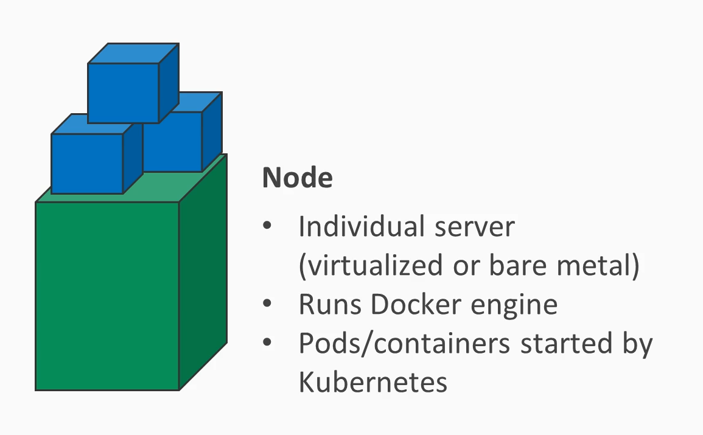
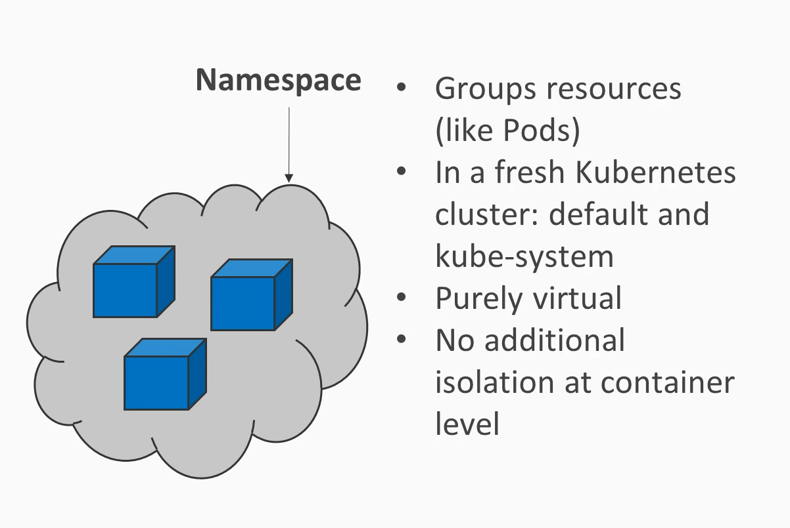
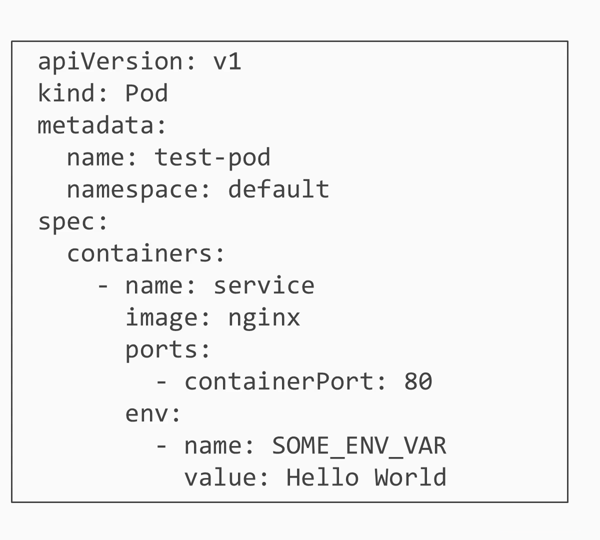
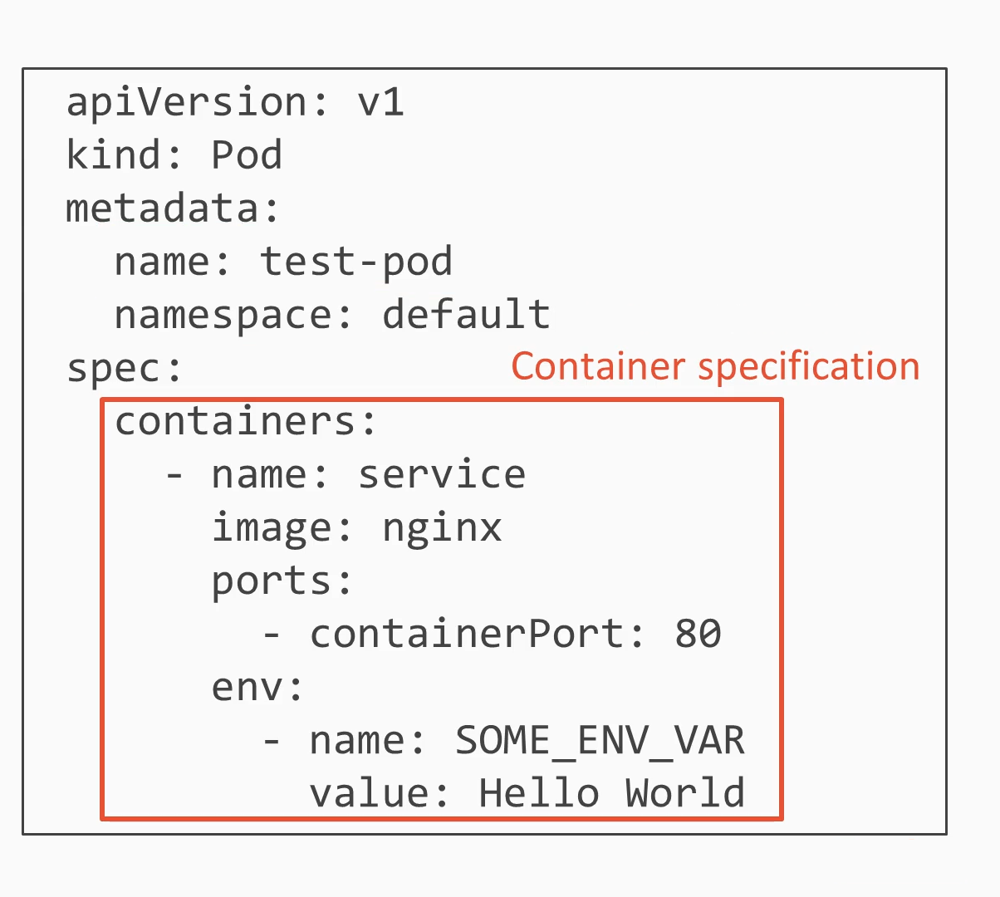
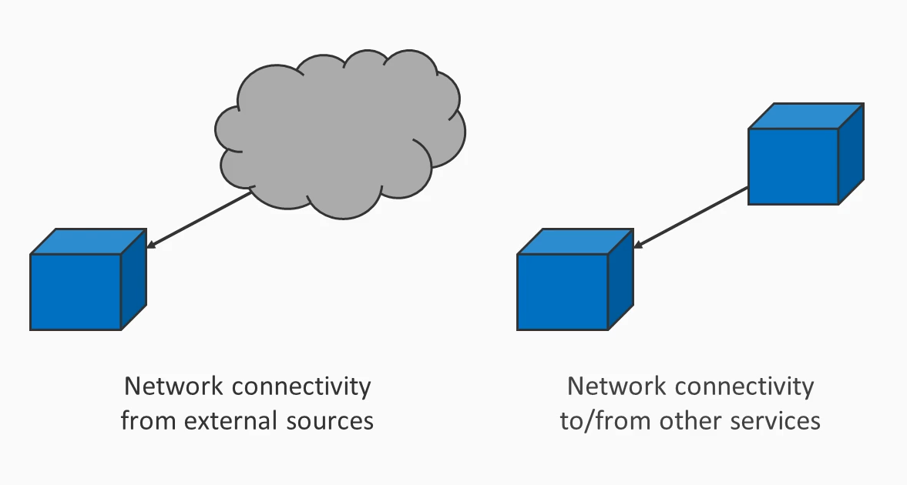

# Recapture basics of Kubernetes (K8s)

### Purpose of Pod?
|  |
|:--------------------------------------------------------:|
|            *Fig-0: Pod as basic unit of K8s*             |

### Purpose of a Node?
|  |
|:--:|
| *Fig-1: What-is-a-Node* |

### Purpose of a Namespace?

|  |
|:--:|
| *Fig-2: Namespace* |

### Example of Pod as YAML Definition

|  |
|:--:|
| *Fig-3: Pod-Example* |


|  |
|:--:|
| *Fig-4: Pod-Example* |

### Commands for Pods
````
kubctl apply -f pod.yaml 
kubctl get pods
````

### Open Question
How do I connect to a pod from outside the cluster?

With a __Service__! 

|  |
|:----------------------------------------------------:|
|       *Fig-6: Connecting to a Pod via Service*       |

