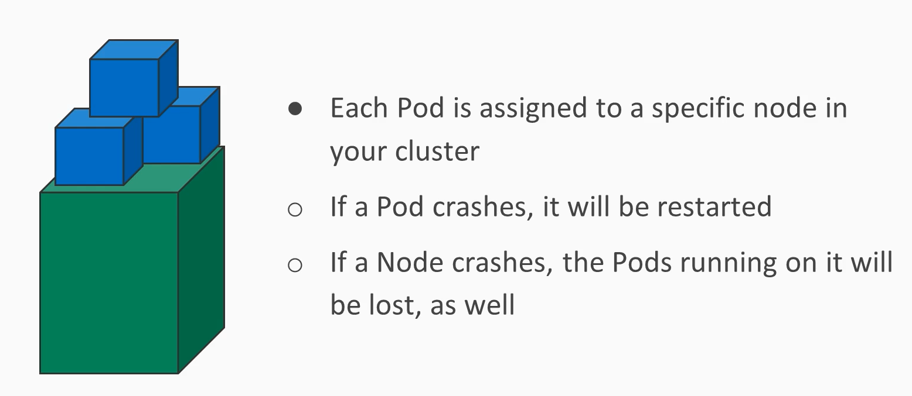
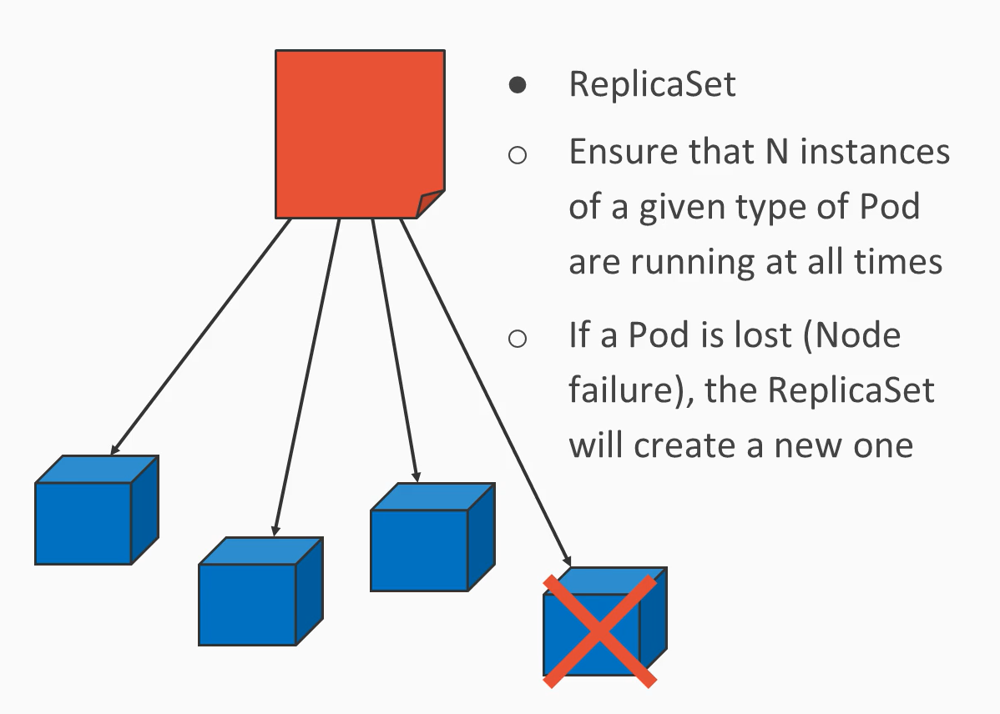
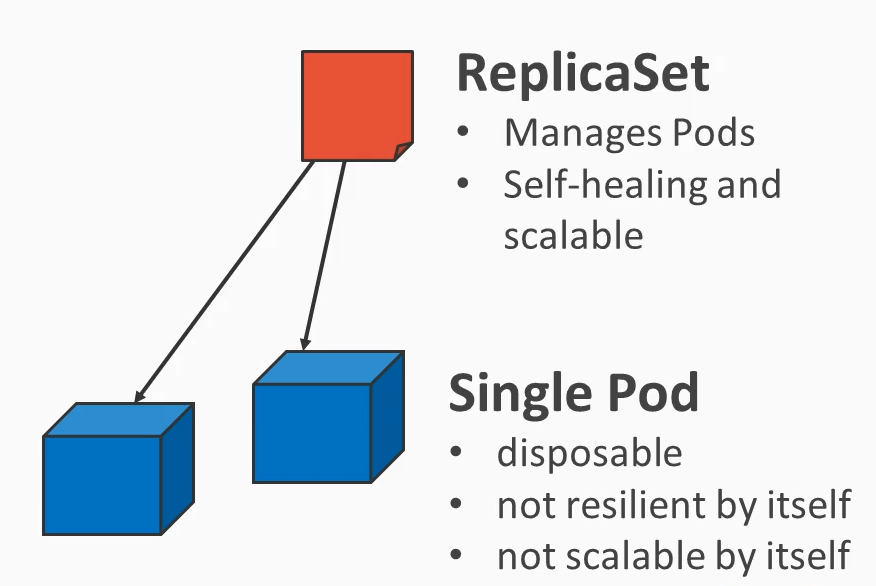
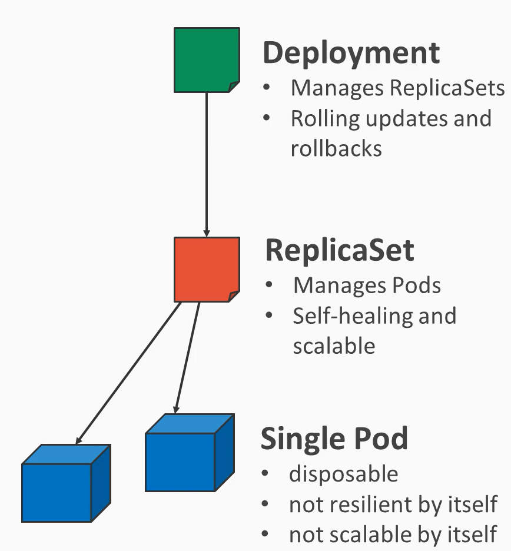
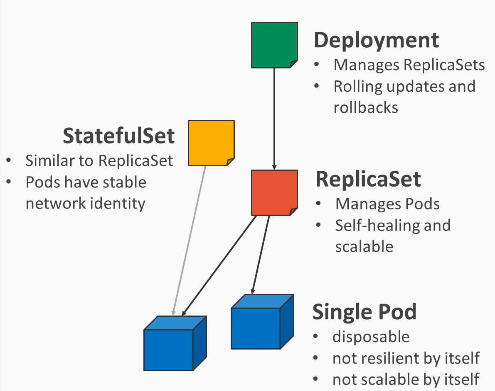

# Service Resiliency and Scalability
Kubernetes Pods are neither resilient nor scalable. 

|  |
|:------------------------------------------------------:|
|                *Fig-1: Pod-Limitations*                |

High-level controllers like ReplicaSets offers solutions for this.

|  |
|:------------------------------------------------------------:|
|                *Fig-2: High-Level-controller*                |

|  |
|:-------------------------------------------------:|
|                *Fig-3: replicaset*                |

|  |
|:-------------------------------------------------:|
|                *Fig-4: deployment*                |

|  |
|:--------------------------------------------------:|
|                *Fig-5: StatefulSet*                |

### In Production: Rule of thumb
Do not manually create a Pod. Instead,
rely on controllers (ReplicaSet, Deployment, StatefulSet)

